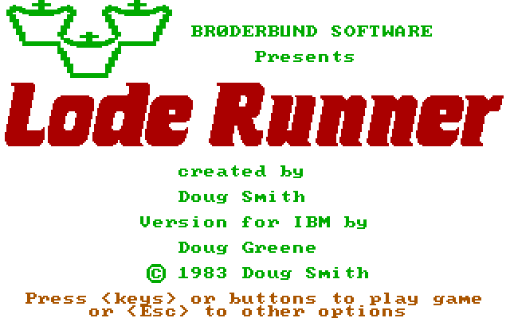

# Lode Runner(-in-a-box)

Play MS-DOS Lode Runner on modern browsers or mobile screens [HERE](https://mad4j.github.io/loderunner-in-a-box/)

Use the following commands

| Action | Key     | Key Alt     | Gesture               |
|--------|---------|-------------|-----------------------|
| Up     | Keypad8 | Arrow Up    | Pan Up                |
| Down   | Keypad2 | Arrow Down  | Pan Down              |
| Left   | Keypad4 | Arrow Left  | Pan Left              |
| Right  | Keypad6 | Arrow Right | Pan Right             |
| Stop   | Keypad5 | Space       | Tap near center       |
| FireL  | Keypad7 | Page Up     | Tap near left corner  |
| FireR  | Keypad9 | Page Down   | Tap near right corner |
| Menu   | Esc     | -           | -                     |
